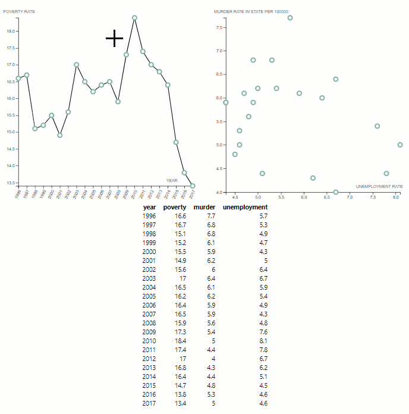

# Assignment: Brushing and Linking

This assignment will help you get started with brushing and linking. Please look through all these materials so you understand how to run and organize your code.

## The Associated GitHub Pages Website

This web page is served automatically from the default `gh-pages` branch at https://phly95.github.io/brushNLink/

## Setup

**Under no circumstances should you be editing files via the GitHub user interface.** Do all your edits locally after cloning the repository.

1. Clone this repository to your local machine. E.g., in your terminal / command prompt `CD` to where you want this the folder for this activity to be. Then run `git clone <YOUR_REPO_URL>`

1. `CD` or open a terminal / command prompt window into the cloned folder.

1. Start a simple python webserver. E.g., one of these commands:
    * `python -m http.server 8000`
    * `python3 -m http.server 8000`
    * `py -m http.server 8000`
    
    If you are using Python 2 you will need to use `python -m SimpleHTTPServer 8000` instead, but please switch to Python 3 as [Python 2 will be sunset on 2020.01.01](https://www.python.org/doc/sunset-python-2/).

1. Wait for the output: `Serving HTTP on 0.0.0.0 port 8000 (http://0.0.0.0:8000/)`

1. Now open your web browser (Firefox or Chrome) and navigate to the URL: http://localhost:8000

## Organization

### Root Files
* `README.md` is this explanatory file for the repo.

* `index.html` contains the main website content.

* `style.css` contains the CSS.

* `LICENCE` is your source code license.

### Folders
Each folder has an explanatory `README.md` file.

* `data` holds the data file for the visualization, `texas.json`.

* `favicons` contains the favicons for the web page. You shouldn't change anything here.

* `js` will contain all JavaScript files you write. E.g.,

  * `visualization.js` is the main code that builds all your visualizations.

  * `scatterplot.js` is the code for creating a scatterplot using a [Reusable Chart model](https://bost.ocks.org/mike/chart/).

  * `linechart.js` is the code for creating a line chart using a [Reusable Chart model](https://bost.ocks.org/mike/chart/).

* `lib` will contain any JavaScript library you use. It currently includes D3.

## Instructions

You will be creating a new table that is connected to the existing scatterplot and line chart using brushing and linking.
Make your edits and commit major versions to your git repository.
**Under no circumstances should you be editing files via the GitHub user interface.** 

1. In `README.md` (this file) update the URL above with your actual GitHub pages URL.

1. In `index.html` update the GitHub repo URL with the URL of your repository. It is in the span with `id="forkongithub"`.

1. Create a new JavaScript file `js/table.js`.

1. Following the [Reusable Chart model](https://bost.ocks.org/mike/chart/) set out in `scatterplot.js` and `linechart.js`, write the code in `js/table.js` necessary for creating a table of all the data in `data/texas.json`. E.g., a header with the four columns for `year`, `poverty`, `unemployment`, and `murder` followed by `22` rows of data like so:

    | year | poverty | unemployment | murder |
    |-----:|--------:|-------------:|-------:|
    | 1996 | 16.6    | 7.7          | 5.7    |
    | 1997 | 16.7    | 6.8          | 5.3    |
    | ...  | ...     | ...          | ...    |

1. Add the necessary `<div>` code to `index.html` to place your table directly below the existing visualizations.

1. Add any necessary CSS to `style.css` for displaying your table.

1. Add code to `js/visualization.js` to create your table in the appropriate `<div>`. It should be of a set height. E.g., it should not resize as you select elements. You may need a scroll bar.

1. Add brushing and highlighting functionality to your table to match both function and style of the scatterplot and line chart.

1. Add code to `js/visualization.js` to create the three-way brushing and linking between the table, line chart, and scatterplot. E.g., selections in any of the three should highlight the associated data marks in **all three** visualizations.

1. Ensure your code passes the [W3 validator](https://validator.w3.org/).


The final interaction should look like this (without the concentric red rings on click):



## Submission Instructions

1. Submit a URL to your GitHub Page (same as the link you edited at the top) to [the associated assignment on Canvas](https://canvas.instructure.com/courses/1711075/assignments/12962345/).

## Tips and Tricks

### How to write a table to the DOM using D3

D3 is not just an SVG data binding and manipulation library, though that is what most of the examples show.
It is actually a general-purpose DOM data binding and manipulation library.
You can thus use it to manipulate arbitrary HTML tags too, e.g., the tags for tables: `<table>`, `<thead>`, `<tbody>`, `<tr>`, `<th>`, `<td>`.

You can [search for at examples online](https://www.google.com/search?&q=d3+html+table), e.g., Jonah Williams' [Interactive HTML Table I](http://bl.ocks.org/jonahwilliams/cc2de2eedc3896a3a96d).
Note that this is using D3 version 3 while you are using D3 version 5, so some changes may be necessary.

### Function/method chaining

D3, and this exercise, use [function chaining](https://en.wikipedia.org/wiki/Method_chaining) to apply several changes to the same visualization.

You don't have to use chaining.
E.g., instead of this:
```js
d3.select("body")
  .append("p")
    .text("Hello, world!");
```
you can write:
```js
var body = d3.select("body");
var p = body.append("p");
p.text("Hello, world!");
```

### JS statements: let vs. var vs. const

To make our code more modular, reusable, and error-free we are limiting variable scope to the relevant parts of the code.
In part, we do this by using [`let` statements](https://developer.mozilla.org/en-US/docs/Web/JavaScript/Reference/Statements/let) instead of [`var`](https://developer.mozilla.org/en-US/docs/Web/JavaScript/Reference/Statements/var) by default so as to not set global variables.
We are also using [`const`](https://developer.mozilla.org/en-US/docs/Web/JavaScript/Reference/Statements/const) to create read-only references.

### ES6 Arrow functions `=>`

Note that this exercise uses the [ES6 Arrow functions](https://developer.mozilla.org/en-US/docs/Web/JavaScript/Reference/Functions/Arrow_functions).
E.g., instead of writing `function(d){ return d.name; }` we write `d => d.name` or `d => { return d.name; }`. We would use the latter version with surrounding `{...}` when we need multiple lines of code vs. just a simple expression.

### How to implement interaction on the table

[`d3.brush`](https://github.com/d3/d3-brush) would be hard to use directly atop an HTML `table`. Instead, think about how you can re-create similar functionality by listening for DOM events. D3's `d3-selection` module can listen for any of the [standard DOM events](https://github.com/d3/d3-selection#handling-events) using the `selection.on(typenames[, listener[, options]])` function.

E.g., to provide row highlighting on mouseover a la Jonah Williams' [Interactive HTML Table I](http://bl.ocks.org/jonahwilliams/cc2de2eedc3896a3a96d) you can listen for [Mouse Events](https://developer.mozilla.org/en-US/docs/Web/Events#Mouse_events) like so:
```js
d3.selectAll("tr")
    .on("mouseover", (d, i, elements) => {
      d3.select(elements[i]).classed("highlighted", true)
    })
    .on("mouseout", (d, i, elements) => {
      d3.select(elements[i]).classed("highlighted", false)
    });
```
This uses the ES6 Arrow functions `=>` (see above).
Note that using the arrow functions we are not able to use `d3.select(this)` like you see in many esp. older D3 examples.
See [this post](https://medium.com/@yonester/on-d3-and-arrow-functions-b6559c1cebb8) for a discussion.

### How we are sending selection updated events

D3 has a module [`d3-dispatch`](https://github.com/d3/d3-dispatch) for emiting and listening for events, which we use to coordinate selection updates between our linked views.

E.g.,
```js
let dispatcher = d3.dispatch("selectionUpdated");
dispatcher.on("selectionUpdated", callback1);
```
However, to have multiple listeners for that same event you would need to have unique suffixes for the same string beginning with '`.`'.
E.g., to have both the line chart and table listening to scatterplot updates we could have
```js
dispatcher.on("selectionUpdated.sp-to-lc", callback1);
dispatcher.on("selectionUpdated.sp-to-tab", callback1);
```
where `"sp-to-lc"` and `"sp-to-tab"` are arbitrary but written here to be informative.

## Grading

You will receive full marks if:

* Instructions are followed
    * Everything is submitted by the due date following the instructions above.
    * Any folders/files are properly named, located as specified, and contain what is expected.
    * Your web page link is correctly updated at the top of this `README.md` file and in the `Fork me on GitHub` banner.

* Coding was done properly:
    * Your code was regularly committed and not edited via the GitHub user interface online.
    * You have clear, commented, and validated code.
    * Your web page loads properly and looks as expected in the latest Firefox and Chrome browsers.
    * Any code from other sources (modified or copied straight) is acknowledged.

* Your visualization works as required:
    * Your table displays all the expected data.
    * Three-way brushing and linking works between the table, line chart, and scatterplot.
    * Styles are consistent across views.
    * None of the visualizations change size or move on the screen as you interact with them.

## Template Repository Setup (For Instructors Only)

### GitHub Pages

It is necessary if using GitHub Classroom to set up GitHub pages for the students, as they do not have admin permissions on their repository. To do this, we need to create and move everything to the `gh-pages` branch and delete the `master` branch.

1. Commit the files to the `master` branch on GitHub.

1. `git branch gh-pages`

1. `git checkout gh-pages`

1. `git branch -D master`

1. `git push origin gh-pages`

1. On GitHub, go to `Settings`->`Branches` and set the default branch to `gh-pages`.

1. `git push origin :master`

### Template Repository

1. On GitHub, go to `Settings` and check the box for `Template repository` at the top. This makes GitHub Classroom copies much faster.
